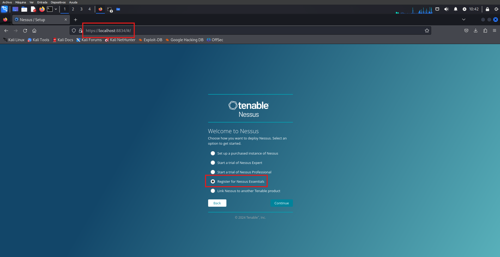

# **Escaneo de Vulnerabilidades con Nessus**

---

---

# Indice

- [**Escaneo de Vulnerabilidades con Nessus**](#escaneo-de-vulnerabilidades-con-nessus)
- [Indice](#indice)
- [Introducción](#introducción)
- [Instalación y Configuración de Nessus](#instalación-y-configuración-de-nessus)
      - [Iniciar Nessus](#iniciar-nessus)
- [Demostración de uso](#demostración-de-uso)
        - [Tipos de reporte:](#tipos-de-reporte)
- [Comparativa de Nessus y OpenVAS](#comparativa-de-nessus-y-openvas)
- [Conclusiones](#conclusiones)

---

# Introducción

Nessus es una herramienta líder en ciberseguridad utilizada para identificar y evaluar vulnerabilidades en redes y sistemas. Desarrollada por Tenable, ofrece escaneos automatizados para detectar debilidades en software, configuraciones incorrectas y otros riesgos de seguridad. Su interfaz intuitiva y su base de datos de plugins actualizados permiten a los profesionales priorizar amenazas y mejorar la seguridad de sus entornos de manera efectiva.

---

# Instalación y Configuración de Nessus

Descargaremos Nessus desde el sitio oficial de Tenable [enlace.](https://www.tenable.com/downloads/nessus?loginAttempted=true)

Una vez descargado el archivo, ejecutaremos el siguiente comando para instalar el paquete:

``sudo dpkg -i Nessus-10.8.2-ubuntu1604_amd64.deb``

Podemos observar que ya ha acabado.

#### Iniciar Nessus

Para iniciar nessus: ``sudo systemctl start nessusd.service``
Para comprobar que está activo: ``sudo systemctl status nessusd.service``

Para entrar en la interfaz desde el navegador tendrémos que poner la siguiente ruta ``https://localhost:8834/``, el puerto 8834 es el que usa nessus por defecto.

Yo voy a darle a ``Register for Nessus Essentials``, ya que es gratis para estudiantes.

Nos guardaremos el ``Activation Code``.

Una vez acabe este proceso, empezará a descargar plugins.

Cuando acabe se nos abrirá la interfaz de Nessus.

Aunque parezca que ya podemos empezar a usarlo, si dejamos el ratón puesto en el símbolo que se señala en la imagen, nos aparecerá que está compilando plugins.

# Demostración de uso

Una vez haya finalizado la compilación de los plugins, ya podemos escanear.

En mi caso, voy a hacer un ``Advanced Scan`` a mis dos máquinas Metasploitable3.

Si quisiesemos programar escaneos, habría que upgradear a Nessus Profesional.

En ``Notifications`` podríamos configurarlo para que cuando un escaneo se complete se envié un correo a la dirección configurada.

Si el escaneo fuese para una red de una empresa en la que hay impresoras y otros dispositivos tecnológicos, en el apartado ``Discovery`` podríamos habilitar que también se escaneen.

En el apartado ``Discovery > Port Scanning > Network Port Scanners``, he optado por seleccionar TCP, SYN y UDP, y activar la opción "override automatic firewall detection > use aggressive detection" para escanear mis dos máquinas Metasploitable3.

Esta configuración me permite realizar un escaneo completo y detallado de ambas máquinas. Al utilizar TCP y SYN, podré identificar puertos abiertos y servicios en ejecución, incluso si están protegidos por firewalls internos. UDP me ayudará a detectar servicios que no usan conexiones de tipo TCP, asegurando que ninguna posible vulnerabilidad quede sin explorar.

La opción de "aggressive detection" es útil para superar las barreras de filtrado y descubrir puertos y servicios que podrían estar ocultos o filtrados. Aunque esta configuración generará más tráfico y será más visible en las máquinas, es adecuada en este entorno de prueba controlado. Esto garantiza que obtenga una visión completa y precisa de las vulnerabilidades en mis máquinas Metasploitable3, permitiéndome identificar y abordar cualquier problema de seguridad de manera efectiva.

En ``Brute Force > General Settings``, desmarqué "Only use credentials provided by the user" y ajusté los valores según el escaneo. Esto permite usar más credenciales y técnicas de fuerza bruta, mejorando la detección de vulnerabilidades, aunque puede ralentizar el escaneo debido al uso de Hydra.

En la sección Web Applications, la configuración sugerida incluye habilitar "Scan web applications", ajustar la "Maximum depth to crawl" a 30, seleccionar "Follow dynamically generated pages", y completar los Application Test Settings según el snapshot.

Sin embargo, debido a que mi máquina virtual no tiene los recursos suficientes, optaré por no realizar estos pasos. Realizar un escaneo web exhaustivo con una profundidad de rastreo alta puede ralentizar significativamente el proceso y afectar el rendimiento de la máquina.

Al final decidí hacer el escaneo a toda mi red, para ello puse ``192.168.1.0/24``, en lugar de las dos IPs de las máquinas metasploitable3. Podemos observar como esta escaneando correctamente.

Una vez acabado el escaneo vamos a sacar el report.

##### Tipos de reporte: 
- Complete List of Vulnerabilities by Host: Muestra todas las vulnerabilidades organizadas por cada host.
- Detailed Vulnerabilities by Host: Ofrece un informe detallado de vulnerabilidades por host, con descripciones y recomendaciones.
- Detailed Vulnerabilities by Plugin: Agrupa vulnerabilidades por el plugin que las detectó, proporcionando detalles técnicos sobre cada plugin.
- Vulnerability Operations: Resumen de las operaciones realizadas en las vulnerabilidades, como la gestión y el seguimiento de su resolución.

Cada opción proporciona una perspectiva diferente para analizar y gestionar las vulnerabilidades encontradas durante el escaneo, ayudando a abordar la seguridad de manera más efectiva según tus necesidades.

En mi caso he seleccionado ``Complete List of Vulnerabilities by Host``.

# Comparativa de Nessus y OpenVAS

- **Costo:** OpenVAS es gratuito, mientras que Nessus requiere una licencia paga.
- **Facilidad de Uso:** Nessus suele ser considerado más fácil de usar debido a su interfaz amigable.
- **Actualización de Vulnerabilidades:** Nessus tiene una base de datos de vulnerabilidades que se actualiza más rápidamente y con más recursos.
- **Soporte y Comunidad:** Nessus ofrece soporte técnico profesional y tiene una gran cantidad de documentación, mientras que OpenVAS se apoya más en la comunidad para el soporte.
  
En resumen, si tienes un presupuesto ajustado o prefieres una solución de código abierto, OpenVAS es una opción sólida. Sin embargo, si buscas una herramienta con soporte profesional, una interfaz más pulida y una base de datos de vulnerabilidades más extensa, Nessus podría ser la mejor opción.

---

# Conclusiones 

En resumen, Nessus ha demostrado ser una herramienta poderosa y versátil para la evaluación de vulnerabilidades, superando a OpenVAS en términos de funcionalidad y facilidad de uso. Su capacidad para ofrecer un análisis exhaustivo y detallado respalda su elección como mi herramienta preferida para la seguridad de redes.

---