<div align="center">

# **Escaneo de Vulnerabilidades con OpenVAS**

---

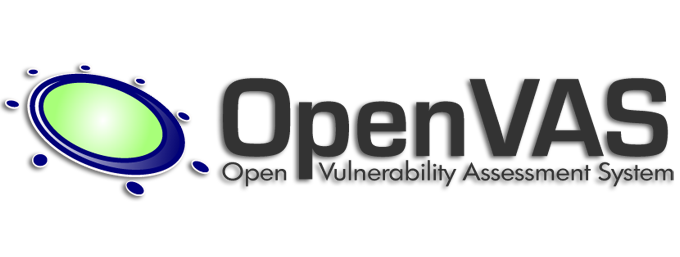


**Autor: Eric Serrano Marín**

</div>

---


# Indice

- [Escaneo de Vulnerabilidades con OpenVAS](#escaneo-de-vulnerabilidades-con-openvas)
- [Propósito del Proyecto](#propósito-del-proyecto)
- [Descubrimiento de la IP de la Máquina Objetivo con NMAP](#descubrimiento-de-la-ip-de-la-máquina-objetivo-con-nmap)
- [Instalación de OpenVAS](#instalación-de-openvas)
- [Evaluación de Vulnerabilidades con OpenVAS](#evaluación-de-vulnerabilidades-con-openvas)
- [Conclusiones](#conclusiones)

---

# Propósito del Proyecto

El próposito de este proyecto es llevar a cabo una evaluación de seguridad utilizando OpenVAS para identificar vulnerabilidades en un entorno controlado. La máquina objetivo para esta evaluación es Metasploitable3, una máquina virtual diseñada específicamente para contener múltiples vulnerabilidades de seguridad. Este proyecto tiene dos objetivos principales:

1. **Descubrimiento de la IP de la Máquina Objetivo:**
   
    Antes de iniciar el escaneo de vulnerabilidades será esencial identificar la dirección IP de la máquina Metasploitable3 en nuestra red local, para ello utilizaremos **nmap**. <br> <br>

2. **Evaluación de Vulnerabilidades con OpenVAS:**
    Una vez identificada la IP de la máquina Metasploitable3, se procederá a realizar un escaneo exhaustivo utilizando OpenVAS. Este escaneo permitirá identificar vulnerabilidades conocidas en la máquina objetivo y evaluar la exposición de posibles amenazas. El análisis proporcionará información crítica sobre los puntos débiles de la máquina y ofrecerá recomendaciones para mitigar los riesgos encontrados.

El proyecto tiene como objetivo demostrar el proceso completo de identificación de una máquina vulnerable en una red local y la evaluación de sus vulnerabilidades, proporcionando una base sólida para la mejora continua en prácticas de seguridad informática.

---

# Descubrimiento de la IP de la Máquina Objetivo con NMAP

Para ello, primero mirarémos cual es la IP de nuestra máquina Kali, que es con la que vamos a hacer este proyecto.

``ip a``

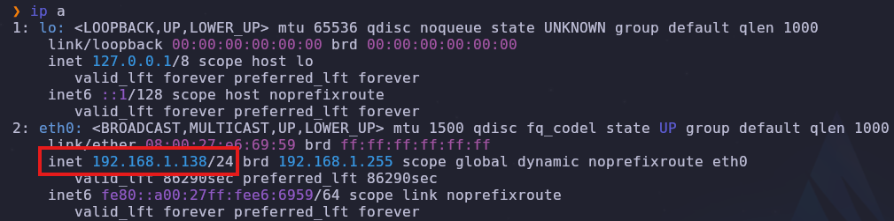

Con esta información sabemos que nuestra IP es la ``192.168.1.138``, y lo que realmente nos importa, que estamos en la red ``192.168.1.0/24``.

La máquina Metasploitable3 suele tener ciertos servicios conocidos, como SSH en el puerto 22, FTP en el puerto 21, entre otros. Por ello, ajustaré el comando para buscar estos servicios específicos y así identificar la máquina más rápidamente.

``nmap -p 21,22,23,80,443,3306 192.168.1.0/24``

De todas las escaneadas podemos observar que claramente es la IP ``192.168.1.34``.

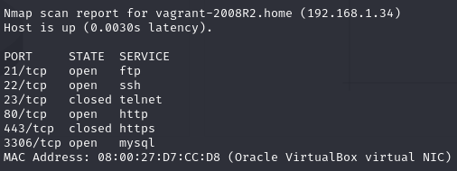

---

# Instalación de OpenVAS

En mi caso no voy a tener que instalarlo, ya que en Kali Linux OpenVAS viene inclúido en sus repositorios.

Para instalar OpenVAS, ya sea en Debian, Ubuntu o Kali Linux.

``sudo apt update && sudo apt upgrade -y``
``sudo apt install openvas``

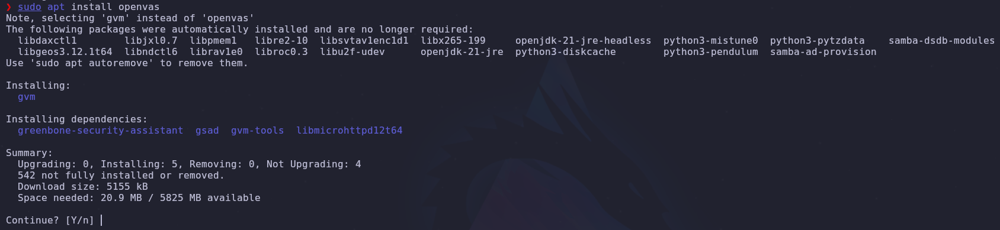


``sudo gvm-setup``

Una vez acabada la instalación es importante guardar la contraseña y el usuario.

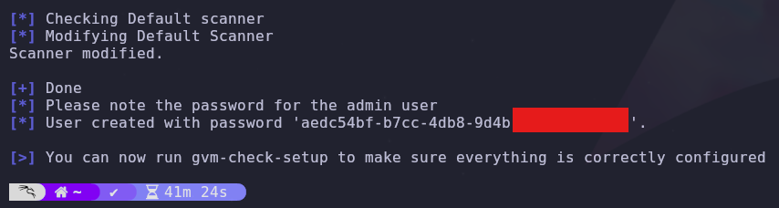

Nos recomienda poner el comando ``gvm-check-setup`` para ver que todo esté correctamente configurado.

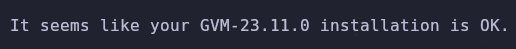

Este comando configura el entorno de Greenbone Vulnerability Manager (OpenVAS), descargando feeds de vulnerabilidades, generando certificados, configurando componentes y creando usuarios necesarios para el funcionamiento del sistema.

También vamos a generar actualizaciones en el feed del greenbone que necesitamos, si no lo hacemos no nos funcionará bien la herrmaienta.

Primero nos aseguraremos de no estar con OpenVAS ejecutado.

``sudo gvm-stop``

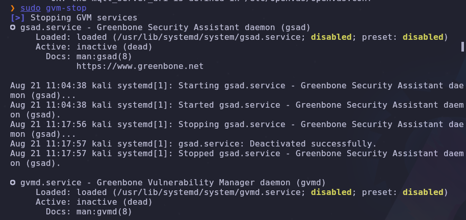

##### GVM_DATA

``sudo greenbone-feed-sync --type GVMD_DATA``

Este comando nos actualizará las bases de datos de vulnerabilidades.

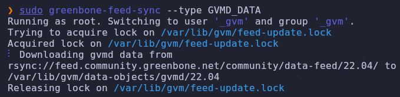

##### SCAP

``sudo greenbone-feed-sync --type SCAP``

Este comando asegura que GVM tenga acceso a la información más reciente sobre estándares de seguridad y configuraciones recomendadas para evaluar la seguridad de los sistemas.

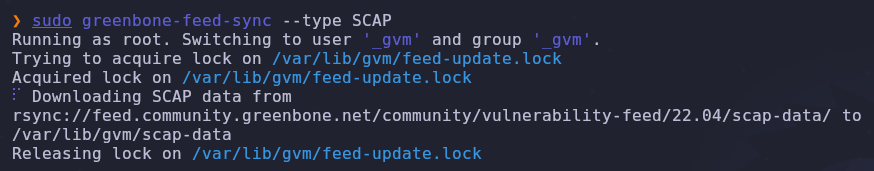

##### CERT

``sudo greenbone-feed-sync --type CERT``

Este comando garantiza que GVM tenga acceso a los certificados más recientes para realizar evaluaciones de seguridad precisas y seguras.


---

# Evaluación de Vulnerabilidades con OpenVAS

``sudo gvm-start``

````
sudo gvm-start
[>] Please wait for the GVM services to start.
[>]
[>] You might need to refresh your browser once it opens.
[>]
[>]  Web UI (Greenbone Security Assistant): https://127.0.0.1:9392

● gsad.service - Greenbone Security Assistant daemon (gsad)
     Loaded: loaded (/usr/lib/systemd/system/gsad.service; disabled; preset: disabled)
     Active: active (running) since Wed 2024-08-21 11:30:00 CEST; 34ms ago
 Invocation: b90c5d387d6045ca8e4fe7936636bd59
       Docs: man:gsad(8)
             https://www.greenbone.net
   Main PID: 153579 (gsad)
      Tasks: 1 (limit: 4606)
     Memory: 1.4M (peak: 1.6M)
        CPU: 15ms
     CGroup: /system.slice/gsad.service
             └─153579 /usr/sbin/gsad --foreground --listen 127.0.0.1 --port 9392

Aug 21 11:30:00 kali systemd[1]: Starting gsad.service - Greenbone Security Assistant daemon (gsad)...
Aug 21 11:30:00 kali systemd[1]: Started gsad.service - Greenbone Security Assistant daemon (gsad).

● gvmd.service - Greenbone Vulnerability Manager daemon (gvmd)
     Loaded: loaded (/usr/lib/systemd/system/gvmd.service; disabled; preset: disabled)
     Active: active (running) since Wed 2024-08-21 11:29:55 CEST; 5s ago
 Invocation: 7c62c5c3b7a049c2ac67b4125dee7b33
       Docs: man:gvmd(8)
    Process: 153497 ExecStart=/usr/sbin/gvmd --osp-vt-update=/run/ospd/ospd.sock --listen-group=_gvm (code=exited, status=0/SUCCESS)
   Main PID: 153498 (gvmd)
      Tasks: 2 (limit: 4606)
     Memory: 177.5M (peak: 177.6M)
        CPU: 4.736s
     CGroup: /system.slice/gvmd.service
             ├─153498 "gvmd: Waiting " --osp-vt-update=/run/ospd/ospd.sock --listen-group=_gvm
             └─153521 "gvmd: Syncing " --osp-vt-update=/run/ospd/ospd.sock --listen-group=_gvm

Aug 21 11:29:54 kali systemd[1]: Starting gvmd.service - Greenbone Vulnerability Manager daemon (gvmd)...
Aug 21 11:29:54 kali systemd[1]: gvmd.service: Can't open PID file /run/gvmd/gvmd.pid (yet?) after start: No such file or directory
Aug 21 11:29:55 kali systemd[1]: Started gvmd.service - Greenbone Vulnerability Manager daemon (gvmd).
Aug 21 11:29:56 kali gvmd[153521]: Warning: program compiled against libxml 212 using older 209

● ospd-openvas.service - OSPd Wrapper for the OpenVAS Scanner (ospd-openvas)
     Loaded: loaded (/usr/lib/systemd/system/ospd-openvas.service; disabled; preset: disabled)
     Active: active (running) since Wed 2024-08-21 11:29:54 CEST; 6s ago
 Invocation: 95d8616f11ee4adbb8064df9b003e1fe
       Docs: man:ospd-openvas(8)
             man:openvas(8)
    Process: 153455 ExecStart=/usr/bin/ospd-openvas --config /etc/gvm/ospd-openvas.conf --log-config /etc/gvm/ospd-logging.conf (code=exited, status=0/SUCCESS)
   Main PID: 153468 (ospd-openvas)
      Tasks: 5 (limit: 4606)
     Memory: 70.7M (peak: 111.3M)
        CPU: 1.030s
     CGroup: /system.slice/ospd-openvas.service
             ├─153468 /usr/bin/python3 /usr/bin/ospd-openvas --config /etc/gvm/ospd-openvas.conf --log-config /etc/gvm/ospd-logging.conf
             └─153470 /usr/bin/python3 /usr/bin/ospd-openvas --config /etc/gvm
/ospd-openvas.conf --log-config /etc/gvm/ospd-logging.conf

Aug 21 11:29:53 kali systemd[1]: Starting ospd-openvas.service - OSPd Wrapper for the OpenVAS Scanner (ospd-openvas)...
Aug 21 11:29:54 kali systemd[1]: Started ospd-openvas.service - OSPd Wrapper for the OpenVAS Scanner (ospd-openvas).

[>] Opening Web UI (https://127.0.0.1:9392) in: 5... 4... 3... 2... 1...

````

La configuración de GVM esta funcionando correctamente. Los servicios clave (``gsad``, ``gvmd`` y ``ospd-openvas``) están activos y en ejecución.

Y se nos abrirá el panel de iniciar sesión en la IP y puerto especificado.


En cuanto iniciemos sesión vamos a ver lo siguiente:

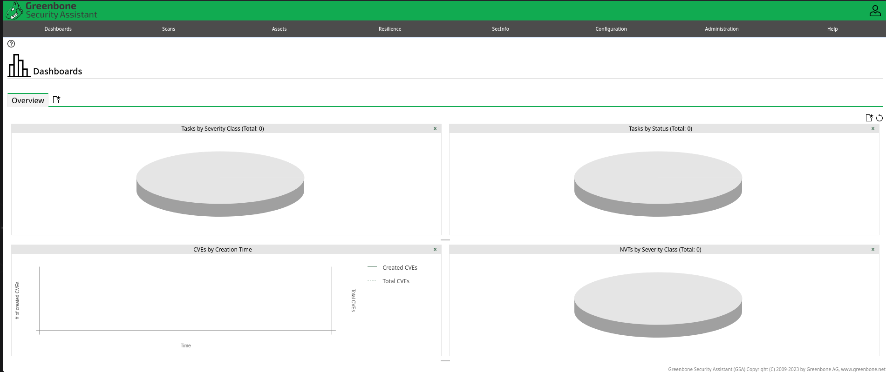

A nosotros lo que nos initeresa es hacer un escaneo de nuestra máquina Metasploitable, asi que le daremos a ``Scans``. Después haremos clic en el icono de la hoja con una estrella y creamos el escaneo.

Tenemos opciones de crear alertas o programar escaneos.

##### Programación de Escaneos

La programación de escaneos nos permite automatizar el proceso de análisis de seguridad en intervalos regulares, asegurando que se revisen continuamente posibles vulnerabilidades y amenazas. Esto es especialmente útil para mantener una postura de seguridad proactiva y detectar problemas antes de que se conviertan en incidentes graves.

##### Creación de Alertas

La creación de alertas es una técnica esencial para notificar a los administradores o equipos de seguridad sobre eventos críticos o resultados de escaneos que requieren atención inmediata. Las alertas permiten una respuesta rápida a posibles amenazas y ayudan a gestionar los riesgos de manera más efectiva.

Información sobre QoD (Quality Of Detection): ``https://securityorb.com/openvas-term-to-know/``

Configuración del Target:

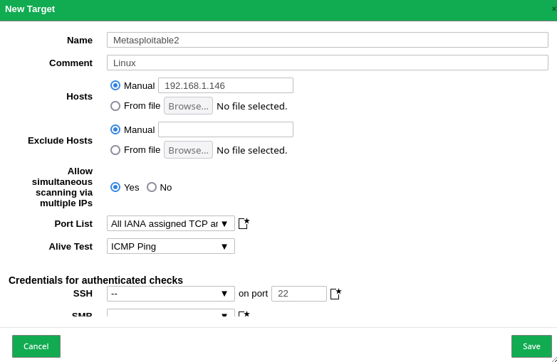

Configuración del escaneo:

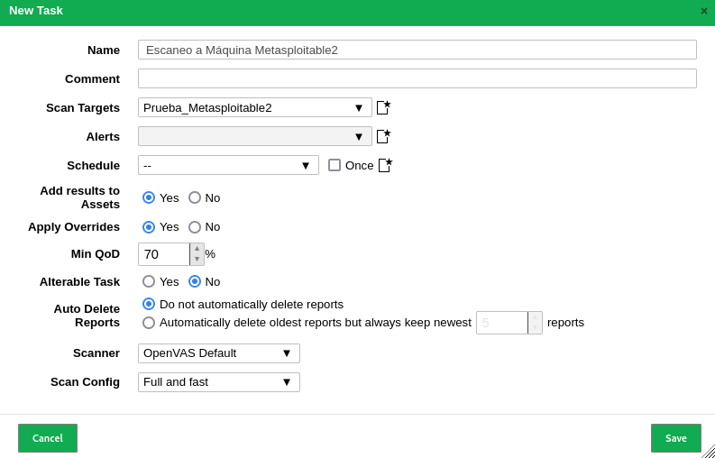


En mi caso, al intentar hacer el scan me daba un error ``Failed to find config ‘daba56c8-73ec-11df-a475-002264764cea``

Este error aparece porque todavía no se han acabado de actualizar los feeds. Si nos vamos al apartado ``Administración > Feed Status`` y podemos observar si el status esta en Upgate in progress o en Current. En mi caso estaba en current, y por ello el error.

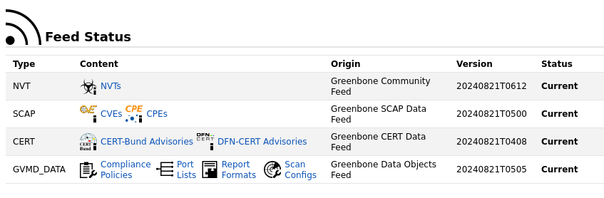

En caso de no actualizarse, podemos usar el comando: ``sudo greenbone-feed-sync``

Mientras se esta haciendo el escaneo, podemos ir mirando los resultados, en este caso estamos viendo las vulnerabulidades.

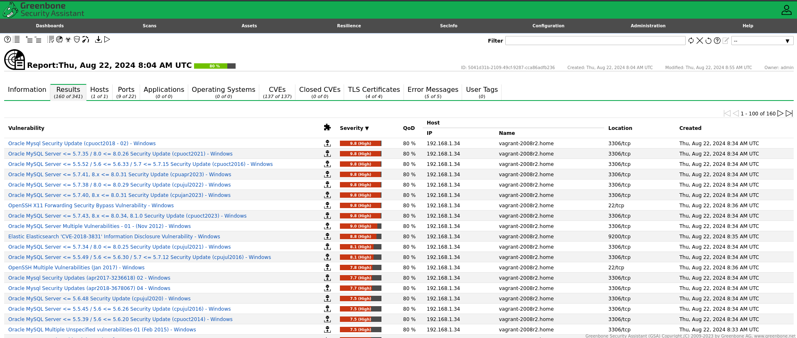

Para el escaneo actual ha habido un cambio de configuración debido a las limitaciones de recursos de mi máquina virtual utilizada, el escaneo ``Full and Fast`` no se pudo realizar de manera efectiva, ya que era extremadamente lento. En su lugar se ha utilizado un escaneo rápido (que aún así, ha tardado 3h).

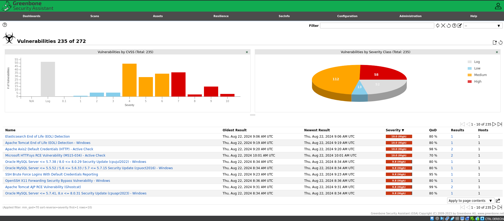

Aquí tenemos el reporte en PDF. 

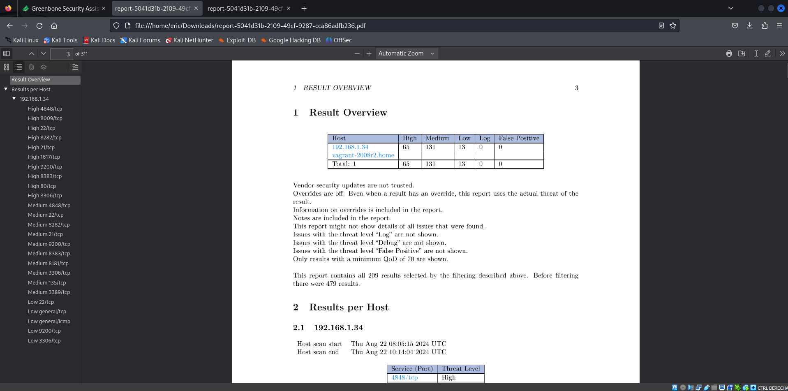

---

# Conclusiones

1. **Eficiencia en la Detección de Vulnerabilidades:**
   OpenVAS proporciona una plataforma robusta para la identificación de vulnerabilidades en sistemas y redes. Sus amplias bases de datos de vulnerabilidades y configuraciones permiten una evaluación detallada y precisa.<br><br>
2. **Flexibilidad en la Configuración:**
   Ofrece diversas opciones de configuración para escaneos, permitiendo adaptarse a diferentes necesidades, desde escaneos rápidos hasta exhaustivos. La capacidad de personalizar configuraciones de escaneo es útil para enfocarse en áreas específicas de interés.<br><br>
3. **Impacto de los Recursos del Sistema:**
   Los escaneos exhaustivos pueden ser intensivos en recursos, especialmente en entornos con hardware limitado. Esto puede resultar en tiempos de escaneo prolongados y en la necesidad de gestionar cuidadosamente los recursos del sistema para evitar interrupciones.<br><br>
4. **Importancia de la Configuración y Mantenimiento:**
   Una configuración adecuada y el mantenimiento regular son cruciales para obtener resultados precisos y fiables. Es importante mantener actualizadas las definiciones de vulnerabilidades y asegurarse de que los servicios relacionados estén correctamente configurados y operativos.<br><br>
5. **Beneficios en la Gestión de Seguridad:**
   OpenVAS facilita una visión integral de la seguridad de la infraestructura TI, ayudando a priorizar y gestionar las vulnerabilidades detectadas. La generación de informes detallados apoya en la toma de decisiones para mejorar la seguridad general.<br><br>
6. **Recomendaciones para el Uso Futuro:**
   Para realizar escaneos más eficientes y rápidos, se recomienda utilizar al menos 8 vCPUs y 4 GB de RAM. Estos recursos permiten manejar mejor la carga de trabajo durante los escaneos extensivos y reducen el tiempo de espera. En comparación, un entorno con 1 CPU y 3 GB de RAM puede experimentar tiempos de escaneo significativamente más largos y posibles limitaciones en el rendimiento, como ha sido mi caso.


