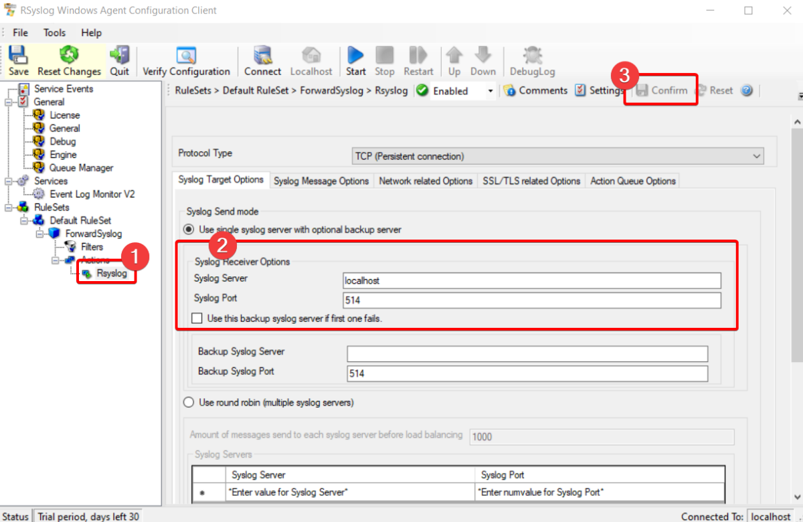
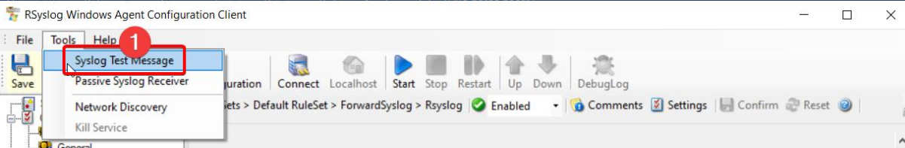

<div align="center">

# **Rsyslog**

---

### **Bastionado de Redes y Sistemas**

---


---

**Autor: Eric Serrano Marín**

</div>

<div>

# Índice

1. Introducción
2. Guía de configuración
2.1. Descripción del entorno
2.2. Pruebas iniciales
1. Configuración de nginx
2. Registro de logs de Windows
3. Conclusiones

</div>

# 1. Introducción

<p>Este proyecto se centra en configurar Rsyslog para gestionar registros de eventos. Incluye la configuración del entorno, pruebas de funcionamiento, y la integración con Nginx para la gestión de logs web. Además, se analizarán los registros de Windows y se desarrollará un script para copiar temporalmente los archivos access y error, comparándolos con las copias de seguridad anteriores. El objetivo es asegurar una gestión eficiente y precisa de los archivos de registro.</p>

# 2. Guía de Configuración

<p>En nuestro entorno existen dos contenedores con Rsyslog preconfigurado para realizar logs remotos. 
Nuestro contenedor srv es quien hará de servidor centralizado de logs y el contenedor cli, será el cliente.

#### Configuración Rsyslog Servidor


<p>Esta configuración establece Rsyslog para recibir registros tanto por TCP como por UDP, con configuraciones específicas para comunicación segura por TCP usando cifrado TLS y autenticación basada en certificados, así como definiendo dónde deben estar ubicadas las claves y certificados de cifrado en el sistema de archivos.</p>

#### Configuración Rsyslog Cliente


<p>Esta configuración del cliente Rsyslog está preparada para recibir mensajes de un host remoto a través de UDP</p>

**Después de esto, hay que comprobar que los logs del cliente se registran en el servidor de logs.**

<p>Para ello, desde el cliente usaremos logger para enviarnos un mensaje de prueba.</p>


<p>Ahora desde el servidor miraremos si nos ha llegado el mensaje de prueba.</p>


<p>Podemos observar que ha llegado el mensaje correctamente.</p>

# 3. Configuración de Nginx

<p>Configuraremos un servidor Nginx para que los logs se registren en el servidor de logs.</p>

#### Instalación de Nginx


#### Cambios en la configuración de Nginx


La línea **access_log /var/log/nginx/access.log;** habilita el registro de accesos. Nginx escribirá los registros de acceso en el archivo **/var/log/nginx/access.log**, esto incluye información sobre cada solicitud que el servidor web recibe, como la dirección IP del cliente, hora de la solicitud, recurso solicitado y más.

Por otro lado, la línea **error_log /var/log/nginx/error.log;** habilita el registro de errores. Se escribirán los errores en el archivo **/var/log/nginx/error.log**, esto incluye mensajes de error generados por el servidor web, lo cual es útil para la depuración y monitoreo del estado del servidor.

#### Comprobación del funcionamiento

##### Log de acceso

<p>Vamos a hacer un curl al servidor web.</p>


<p>Comprobamos el archivo access.log.</p>

**IP servidor: 172.18.0.3**
**IP cliente: 172.18.0.2**


Prueba del funcionamiento en gif: **https://imgur.com/XE7GsKv**

##### Log de error

<p>Para ello, vamos a hacer un curl al servidor con una ruta que no existe, con ello vamos a conseguir que nos de error.</p>


Prueba del funcionamiento en gif: **https://imgur.com/Khk7Pxr**

# 4. Script de Seguridad para la Gestión de Logs

```sh
#!/bin/sh
# Definir las rutas de los archivos de log y el directorio de copias de seguridad
ACCESS_LOG="/var/log/nginx/access.log"
ERROR_LOG="/var/log/nginx/error.log"
BACKUP_DIR="/var/log/sha_logs"

# Crear el directorio de copias de seguridad si no existe
mkdir -p "$BACKUP_DIR"

# Crear copias de seguridad anteriores si no existen
if [ ! -f "$BACKUP_DIR/access.log.backup" ]; then
 cp "$ACCESS_LOG" "$BACKUP_DIR/access.log.backup"
fi
if [ ! -f "$BACKUP_DIR/error.log.backup" ]; then
 cp "$ERROR_LOG" "$BACKUP_DIR/error.log.backup"
fi

# Crear nuevas copias de seguridad de los archivos de log
cp "$ACCESS_LOG" "$BACKUP_DIR/access.log.tmp"
cp "$ERROR_LOG" "$BACKUP_DIR/error.log.tmp"

# Comparar las copias de seguridad anteriores con las actuales
if cmp -s "$BACKUP_DIR/access.log.backup" "$BACKUP_DIR/access.log.tmp" && \
 cmp -s "$BACKUP_DIR/error.log.backup" "$BACKUP_DIR/error.log.tmp"; then
 echo "Los archivos de log son iguales."
else
 echo "¡Los archivos de log han cambiado!"
 echo "Aquí están las diferencias en el archivo de acceso:"
 diff "$BACKUP_DIR/access.log.backup" "$BACKUP_DIR/access.log.tmp"
 echo "---------------------------------------------"
 echo "Aquí están las diferencias en el archivo de error:"
 diff "$BACKUP_DIR/error.log.backup" "$BACKUP_DIR/error.log.tmp"
fi

# Mover las copias de seguridad temporales a las anteriores
mv "$BACKUP_DIR/access.log.tmp" "$BACKUP_DIR/access.log.backup"
mv "$BACKUP_DIR/error.log.tmp" "$BACKUP_DIR/error.log.backup"

```
Este script hace copias temporales de los archivos de registro **(access.log.tmp y error.log.tmp)** y las compara con las copias de seguridad anteriores
**(access.log.backup y error.log.backup)**. Si ve algún cambio, muestra las diferencias y luego actualiza las copias de seguridad anteriores con las nuevas copias temporales.

Si no hay cambios, simplemente dice que los archivos de registro son iguales. 

En la siguiente captura podemos observar cómo desde el cliente hago un curl y el script me detecta que ha cambiado.


En la siguiente captura lo mismo, pero esta vez con errors, lanzando un curl a una dirección no existente.


Ahora, vamos a borrar manualmente alguna línea de nuestros archivos **access.log** y **errors.log**, y así comprobar que nuestro script esta funcionando correctamente. 

Voy a borrar la línea del medio.


Podemos observar que nos avisa de los que archivos de log han cambiado y nos dice que ha cambiado. Nos aparece el símbolo "**-**" que significa que se ha borrado.


# Registro de logs de Windows

Para esta parte vamos a instalar en un cliente Windows un agente de log remoto. En este caso usaremos Rsyslog.

Configuraremos el receiver, que va a ser nuestra máquina rsyslog que tenemos en Docker. 

**Rule Sets > Default Rule Set > ForwardSyslog > Rsyslog.**



Después nos dirigiremos a **Tools > Syslog Test Message** para enviar un mensaje para ver si está funcionando correctamente.



Con el comando **tail -f messages** podemos observar como al enviar el mensaje lo recibimos correctamente.


Funcionamiento en Gif: **https://imgur.com/LhGcjnd**

# Conclusiones

1. **Automatización de la Seguridad**: La creación de scripts automatiza el proceso de copia de seguridad y comparación de logs, reduciendo la posibilidad de errores humanos y asegurando que los logs estén siempre protegidos.
   
2. **Detección de Cambios**: Utilizar un script en shell es una solución sencilla y eficiente que puede ser implementada rápidamente en cualquier sistema basado en Unix. Esto hace que la práctica sea accesible incluso para aquellos con conocimientos básicos de scripting.

3. **Mejora la Gestión de Logs**: Al tener copias de seguridad regulares y un sistema de comparación, se mejora la gestión de los logs, facilitando la auditoría y el análisis de eventos pasados en caso de incidentes de seguridad.

4. **Escalabilidad**: Este enfoque puede ser fácilmente escalado para incluir más archivos de log o para integrarse con sistemas de monitoreo y alertas más avanzados, proporcionando una base sólida para una estrategia de seguridad más amplia.


