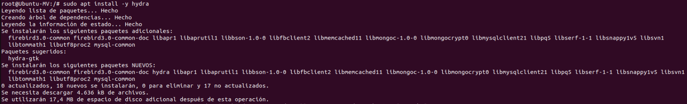
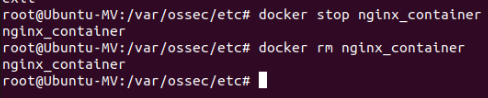
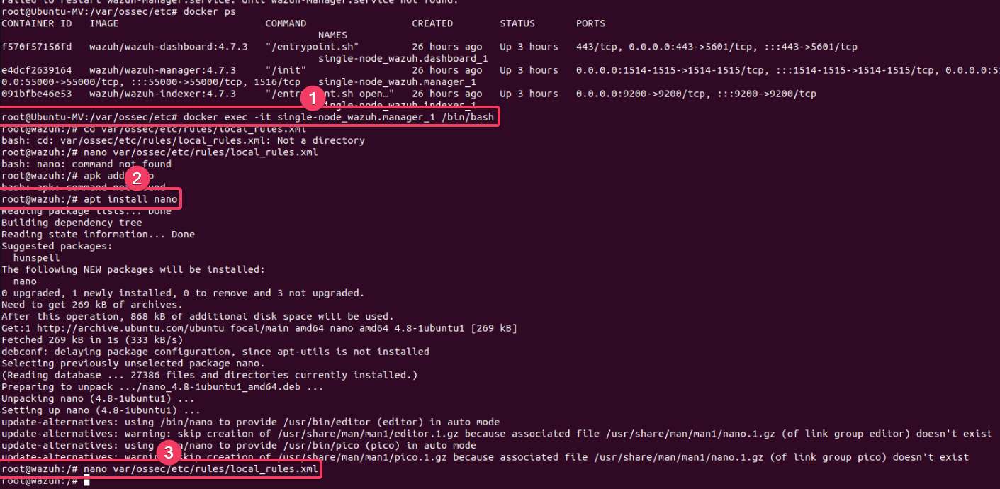
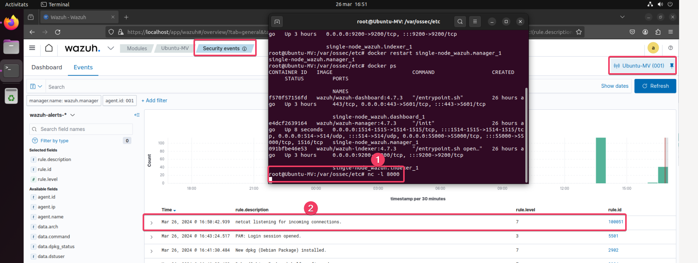
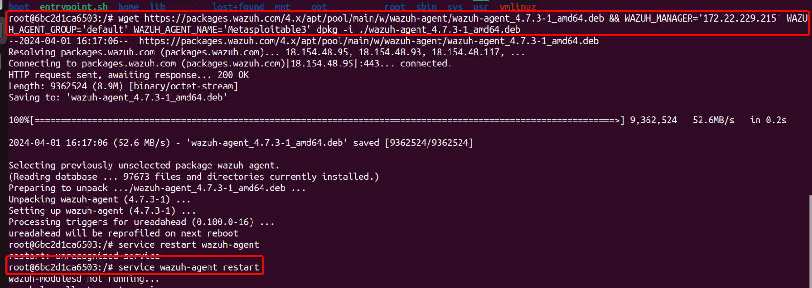

# **Implementación y Pruebas de Seguridad con Wazuh**
## **Instalación, Monitorización y Evaluación**

---

---

# Indice
- [**Implementación y Pruebas de Seguridad con Wazuh**](#implementación-y-pruebas-de-seguridad-con-wazuh)
  - [**Instalación, Monitorización y Evaluación**](#instalación-monitorización-y-evaluación)
- [Indice](#indice)
- [Introducción](#introducción)
  - [Objetivos del proyecto](#objetivos-del-proyecto)
- [Instalación de Wazuh](#instalación-de-wazuh)
- [Pruebas de Concepto con Wazuh](#pruebas-de-concepto-con-wazuh)
  - [Monitoreo de integridad de archivos](#monitoreo-de-integridad-de-archivos)
  - [Detección de ataques de fuerza bruta](#detección-de-ataques-de-fuerza-bruta)
  - [Monitoreo de eventos de Docker](#monitoreo-de-eventos-de-docker)
  - [Detección de procesos no autorizados](#detección-de-procesos-no-autorizados)
- [Evaluación de seguridad de Wazuh](#evaluación-de-seguridad-de-wazuh)
- [Conclusiones](#conclusiones)

---

# Introducción

En un entorno donde la seguridad de la información es crucial, Wazuh emerge como una plataforma de código abierto que ofrece soluciones para la detección de intrusiones, monitoreo de integridad de archivos, y análisis de vulnerabilidades. Este trabajo explora la instalación y configuración de Wazuh, y realiza diversas pruebas de concepto enfocadas en la seguridad, como la detección de ataques de fuerza bruta y el monitoreo de eventos en Docker. Además, se crea un dashboard para monitorizar alertas y se evalúa la seguridad de una máquina metasploitable mediante la instalación de un agente Wazuh. El objetivo es demostrar cómo Wazuh puede mejorar la seguridad de un sistema de información.

---

## Objetivos del proyecto

1. **Instalar y configurar Wazuh en un entorno controlado:**
    - Implementar Wazuh en un entorno de laboratorio utilizando Docker, asegurando la correcta instalación y configuración del sistema.
2. **Reproducir pruebas de concepto basadas en la documentación de Wazuh:**
    - Seleccionar y ejecutar cuatro pruebas de concepto, enfocadas en el monitoreo de integridad de archivos, detección de ataques de fuerza bruta, monitoreo de eventos en Docker, y la detección de procesos no autorizados.
3. **Desarrollar un Dashboard personalizado para la monitorización de alertas:**
    - Crear un dashboard que incluya al menos tres indicadores clave, permitiendo la visualización y análisis de las alertas generadas durante las pruebas de concepto.
4. **Evaluar la seguridad de máquinas vulnerables utilizando Wazuh:**
    - Instalar y configurar un agente de Wazuh en máquinas metasploitables y analizar los resultados de las evaluaciones de seguridad realizadas por la plataforma.
5. **Identificar y resolver desafíos técnicos en la implementación de Wazuh:**
    - Documentar los problemas encontrados durante el proceso de configuración y pruebas, y describir las soluciones implementadas para asegurar el correcto funcionamiento del sistema.
6. **Reflexionar sobre el aprendizaje y los resultados obtenidos:**
    - Evaluar el proceso de aprendizaje a través de la implementación práctica, identificando áreas de mejora y temas adicionales de estudio, como la creación avanzada de visualizaciones en Wazuh.
---

# Instalación de Wazuh
En mi caso voy a hacer la instalación en Docker, en mi ordenador Windows. Empezaremos clonando el repositorio.

``git clone https://github.com/wazuh/wazuh-docker.git%20-b%20v4.7.3``

Obtenemos los certificados: ``docker-compose -f generate-indexer-certs.yml`` (antes tendrémos que entrar en la carpeta ``wazuh-docker\single-node``)

Lo ejecutamos. 

``docker-compose up``

Como podemos ver en nuestra aplicación de Docker, ya tenemos ``wazuh-dashboard, wazuh-indexer y wazuh-manager`` ejecutándose.

Haremos clic en ``wazuh-dashboard`` y se nos abrirá el dashboard en nuestro navegador. Para acceder el usuario es ``admin`` y la contraseña ``SecretPassword``

Para añadir agentes:

1. Seleccionaremos el tipo de sistema operativo.
2. Pondremos la IP de la máquina que queremos añadir
3. Le asignaremos un nombre de agente.
4. Ejecutaremos el comando en el sistema operativo que queremos como agente.
5. Ejecutamos el agente ``NET START WazuhSVC``.

Añadiendo Linux Mint.

Añadiendo Kali Linux

Como podemos observar, yo he añadido dos máquinas que tengo en proxmox, un Linux Mint y un Kali Linux.

---

# Pruebas de Concepto con Wazuh

Para estas pruebas de concepto vamos a usar la [documentación oficial de Wazuh](https://documentation.wazuh.com/current/proof-of-concept-guide/index.html).

## Monitoreo de integridad de archivos

Seguiremos las instrucciones detalladas en la guía para la prueba de concepto de [monitoreo de integridad de archivos](https://documentation.wazuh.com/current/proof-of-concept-guide/poc-file-integrity-monitoring.html), disponible en el siguiente enlace:

Empezaremos editando el archivo ossec.conf, que se encuentra en ``var/ossec/etc/ossec.conf``.

Con esto estamos especificando los directorios que el agente de Wazuh debe monitorear.

Una vez cambiado y guardado el fichero ossec.conf, reiniciamos Wazuh. ``sudo systemctl restart wazuh-agent``.

Con la configuración realizada, Wazuh debería mostrar la creación, eliminación o modificación de archivos en tiempo real. En la imagen a continuación, se puede observar que Wazuh está monitoreando correctamente: se ha registrado la adición de un archivo, seguido de su eliminación.

## Detección de ataques de fuerza bruta

Seguiremos las instrucciones detalladas en la guía para la prueba de concepto de [detección de ataques de fuerza bruta](https://documentation.wazuh.com/current/proof-of-concept-guide/detect-brute-force-attack.html).

Empezaremos con la instalación de Hydra.

Primero vamos a hacer un ataque con hydra, con una lista de contraseñas en las que no está la correcta.

Podemos observar como nos está detectando el ataque de fuerza bruta.

Procedemos a añadir la contraseña correcta al listado de contraseñas.

Podemos observar como ahora recibimos el mensaje de que se ha abierto una sesión.

## Monitoreo de eventos de Docker

Seguiremos las instrucciones detalladas en la guía para la prueba de concepto de [monitoreo de eventos de Docker](https://documentation.wazuh.com/current/proof-of-concept-guide/monitoring-docker.html).

Editaremos el fichero para poner "yes" ``/var/ossec/etc/ossec.conf``

Reiniciaremos ``systemctl restart wazuh-agent``

Vamos a coger una imagen con docker y a realizar acciones con ella.

Lo paramos y borramos.

Podemos observar en ``Security events`` que cada cosa que hemos hecho nos aparece correctamente.

## Detección de procesos no autorizados

Seguiremos las instrucciones detalladas en la guía para la prueba de concepto de [detección de procesos no autorizados](https://documentation.wazuh.com/current/proof-of-concept-guide/detect-unauthorized-processes-netcat.html), disponible en el siguiente enlace:

Añadimos lo siguiente al fichero ossec.conf

Reiniciamos wazuh-agent

Ahora entraremos en ``wazuh-manager`` para cambiar el fichero local_rules.xml.

Aqui tenemos el contenido añadido al fichero local_rules.xml

Ponemos netcat a escuchar y comprobamos que la alerta de seguridad nos salte.

# Evaluación de seguridad de Wazuh

En mi caso lo voy a probar con metasploitable2, asi que procedo a descargarlo.

Añadimos al ossec.config la IP de la máquina metasploitable2.

Hacemos un reload.

Podemos observar como el agente se ha añadido correctamente.

Podemos observar, como no nos da ningun resultado.

Añadimos al archivo ossec.conf del servidor lo siguiente:

Reiniciamos wazuh-manager.

Gracias a cambiar a estos cambios en el fichero ossec.conf, nos han salido los resultados de una de las máquinas ubuntu que tenía como agente, pero no de nuestra metasploitable.

Después de investigar, me he dado cuenta que el contenedor de metasploitable2 es Debian Trixie, y Trixie no se encuentra entre los hosts permitidos. Y si lo añadimos nosotros, da un error al reiniciar el servicio.

La solución a la que he llegado, es usar otro contendor distinto de metasploitable, en este caso el 3, que es Trusty.

Podemos observar que Ubuntu trusty si está en la lista.

Vamos a usar el siguiente contenedor: [Metasploitable3-Ubuntu](https://hub.docker.com/r/hunterg05s/metasploitable3-ub1404)

Instalación del agente

Podemos observarlo ya activo.

Y ya pasado 5/10min, ya podemos observar que nos ha sacado sus vulnerabilidades.

# Conclusiones

En conclusión, Wazuh se ha confirmado como una solución robusta y flexible para la gestión de la seguridad, ofreciendo capacidades avanzadas de monitoreo y análisis. La implementación exitosa y la evaluación de su rendimiento durante este proyecto destacan su valor en la protección de sistemas y su importancia en la estrategia de seguridad de TI. La experiencia obtenida subraya tanto las fortalezas como las áreas de mejora, proporcionando una base sólida para futuras implementaciones y optimizaciones.

---
